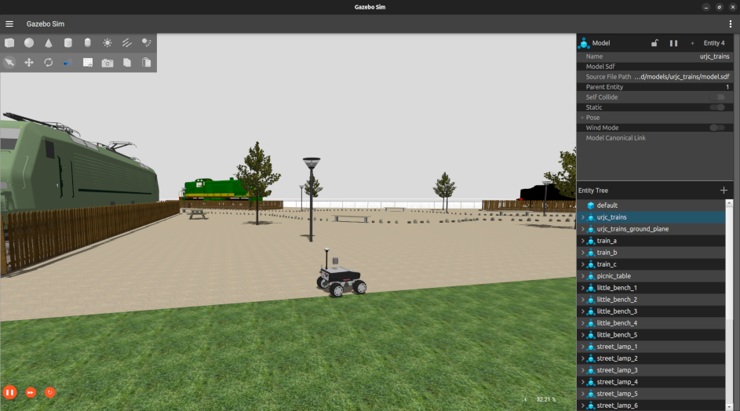

# URJC trains World ROS package

The simulation enviroment is based on URJC Fuenlabrada Campus, where it is located this set of trains. This world could be used to create new algorithms in localization or navigation. 




# Include the world from another package

<!-- * Update .rosinstall to clone this repository and run `rosws update` -->
<!-- ```
- git: {local-name: src/urjc-excavation-world, uri: 'https://github.com/juanscelyg/urjc-excavation-world.git', version: main}
``` -->
* Add the following to your launch file:
```python
    urjc_excavation = launch.actions.IncludeLaunchDescription(
        launch.launch_description_sources.PythonLaunchDescriptionSource(
            os.path.join(
                get_package_share_directory('urjc_trains_world'),
                'launch',
                'urjc_trains.launch.py')))
```

# Load directly into Gazebo (without ROS)
```bash
export GAZEBO_MODEL_PATH=`pwd`/models
gz sim worlds/urjc_trains.world
```

# ROS Launch with Gazebo viewer (without a robot)
```bash
# build for ROS
source /opt/ros/jazzy/setup.bash
source /usr/share/gazebo/setup.sh
rosdep install --from-paths . --ignore-src -r -y
colcon build

# run in ROS
source install/setup.sh
ros2 launch urjc_trains_world urjc_trains.launch.py
```
There is another world with trees, with this kind of mesh is more complex to compute iterations for the physical engine. You can load it with the following command:

```bash
ros2 launch urjc_trains_world urjc_trains_tree.launch.py
```

<!-- # Building
Include this as a .rosinstall dependency in your SampleApplication simulation workspace. `colcon build` will build this repository.

To build it outside an application, note there is no robot workspace. It is a simulation workspace only.

```bash
rosws update
rosdep install --from-paths . --ignore-src -r -y
colcon build
``` -->
